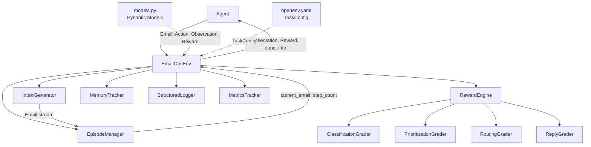

# Design Document: openenv-email-ops

## Overview

The `openenv-email-ops` system is a production-grade OpenEnv reinforcement learning environment that simulates enterprise inbox management. AI agents interact with a simulated email inbox through a standard `reset()` / `step()` / `state()` interface, learning to classify, prioritize, route, and reply to emails across multi-step episodes.

The system is built in Python using Pydantic v2 for schema validation, exposes three difficulty-tiered tasks (EASY, MEDIUM, HARD), and ships with a baseline OpenAI-backed inference script. The entire stack is Dockerized and deployable to Hugging Face Spaces.

### Key Design Goals

- Full OpenEnv interface compliance with no custom integration required
- Deterministic episode replay via seeded random generation
- Modular, independently testable grader components
- Memory-based reward shaping to teach long-term consequence awareness
- Clean separation between environment logic, graders, models, and I/O

---

## Architecture



### Module Layout

```
openenv_email_ops/
├── env.py              # EmailOpsEnv: main OpenEnv interface
├── models.py           # Pydantic models: Email, Action, Observation, Reward, EpisodeInfo, TaskConfig
├── inbox_generator.py  # Seeded email stream generation with noise injection
├── graders.py          # ClassificationGrader, PrioritizationGrader, RoutingGrader, ReplyGrader
├── reward_engine.py    # Aggregates grader outputs, applies bonuses/penalties
├── memory_tracker.py   # Tracks per-email decision timestamps, deferred counts
├── episode_manager.py  # Manages inbox state, step count, termination
├── pretty_printer.py   # Serializes Pydantic models to human-readable text
├── parser.py           # Deserializes structured input into Pydantic models
└── metrics.py          # Per-episode metrics accumulation

inference.py            # Baseline OpenAI-backed agent script
openenv.yaml            # Machine-readable environment/task metadata
Dockerfile
requirements.txt
```

---

## Components and Interfaces

### EmailOpsEnv

The central environment class. Implements the OpenEnv interface.

```python
class EmailOpsEnv:
    def reset(self, seed: int | None = None) -> Observation: ...
    def step(self, action: Action) -> tuple[Observation, Reward, bool, dict]: ...
    def state(self) -> dict: ...
```

- `reset()` clears episode state, generates a new inbox, returns initial Observation
- `step(action)` validates the action, advances the episode, computes reward, returns the 4-tuple
- `state()` returns a serializable snapshot of current internal state
- Raises `RuntimeError` if `step()` is called after `done=True`
- Raises `ValidationError` (Pydantic) for malformed actions

### InboxGenerator

Generates a seeded, reproducible list of `Email` objects with realistic noise.

```python
class InboxGenerator:
    def generate(self, size: int, seed: int) -> list[Email]: ...
```

- Uses `random.Random(seed)` for determinism
- Ensures at least one email per `sender_type` (customer, spammer, VIP, internal)
- Injects noise: typos, informal phrasing, ambiguous subjects
- Attaches hidden `GroundTruth` labels to each email

### EpisodeManager

Manages inbox state and step progression.

```python
class EpisodeManager:
    def current_email(self) -> Email | None: ...
    def advance(self) -> None: ...          # pop front email
    def defer(self, email: Email) -> None:  # move to end of inbox
    def is_done(self) -> bool: ...
    def inbox_summary(self) -> dict: ...
```

### RewardEngine

Aggregates grader scores and applies bonuses/penalties per the reward function spec.

```python
class RewardEngine:
    def score_step(self, action: Action, email: Email, task: TaskConfig, memory: MemoryState) -> Reward: ...
    def finalize_episode(self, memory: MemoryState) -> float: ...
```

### Graders

Each grader is a stateless, deterministic callable:

```python
class ClassificationGrader:
    def score(self, predicted: str, ground_truth: str) -> float: ...  # 0.0 or 1.0

class PrioritizationGrader:
    def score(self, predicted: str, ground_truth: str) -> float: ...

class RoutingGrader:
    def score(self, predicted: str, ground_truth: str) -> float: ...

class ReplyGrader:
    def score(self, reply: str, email: Email) -> float: ...  # heuristic, [0.0, 1.0]
```

`ReplyGrader` checks: length >= 20 chars, presence of greeting, subject keyword overlap, absence of placeholder text.

### MemoryTracker

Tracks per-email decision history within an episode.

```python
class MemoryTracker:
    def record_action(self, email_id: str, action: Action, step: int) -> None: ...
    def deferral_count(self, email_id: str) -> int: ...
    def steps_since_received(self, email_id: str, current_step: int) -> int: ...
    def all_vip_handled(self, inbox: list[Email]) -> bool: ...
```

### PrettyPrinter and Parser

```python
class PrettyPrinter:
    def to_text(self, obs: Observation) -> str: ...   # human-readable for LLM prompt
    def to_json(self, model: BaseModel) -> str: ...   # JSON serialization

class Parser:
    def parse_action(self, raw: str) -> Action: ...   # from LLM output
    def parse_yaml(self, path: str) -> dict: ...      # openenv.yaml
```

---

## Data Models

All models are defined in `models.py` using Pydantic v2.

### Email

```python
class GroundTruth(BaseModel):
    correct_classification: Literal["spam", "important", "promotion"]
    correct_priority: Literal["low", "medium", "high"]
    correct_route: Literal["support", "sales", "escalation"]

class Email(BaseModel):
    id: str                          # UUID, stable within episode
    subject: str
    body: str
    sender_type: Literal["customer", "spammer", "VIP", "internal"]
    urgency_score: float             # field validator: 0.0 <= x <= 1.0
    ground_truth: GroundTruth        # excluded from Observation serialization
```

### Action

```python
class Action(BaseModel):
    action_type: Literal["classify_email", "prioritize_email", "route_email",
                          "generate_reply", "defer_email"]
    value: str | None = None         # required for all except defer_email
```

Uses a discriminated union pattern via `Literal` types. `ValidationError` raised for unknown `action_type`.

### Observation

```python
class InboxSummary(BaseModel):
    counts_by_sender_type: dict[str, int]
    urgency_distribution: dict[str, int]  # low/medium/high buckets

class Observation(BaseModel):
    current_email: Email | None          # None when inbox empty
    inbox_summary: InboxSummary
    action_history: list[Action]
    step_count: int

    model_config = ConfigDict(
        json_encoders={Email: lambda e: e.model_dump(exclude={"ground_truth"})}
    )
```

Ground truth is excluded from serialization via a custom encoder.

### Reward

```python
class Reward(BaseModel):
    step_reward: float
    episode_reward: float
    breakdown: dict[str, float]   # e.g. {"classification": 0.2, "deferral_penalty": -0.05}
```

### EpisodeInfo

```python
class EpisodeInfo(BaseModel):
    total_reward: float
    classification_accuracy: float
    prioritization_accuracy: float
    routing_accuracy: float
    vip_handling_rate: float
    deferral_count: int
    delayed_rewards: dict[str, float]   # deferred reward components
```

### TaskConfig

```python
class TaskConfig(BaseModel):
    task_id: str
    description: str
    difficulty: Literal["easy", "medium", "hard"]
    max_steps: int
    inbox_size: int
    reward_components: list[str]   # which graders are active
```

---

## Correctness Properties

*A property is a characteristic or behavior that should hold true across all valid executions of a system — essentially, a formal statement about what the system should do. Properties serve as the bridge between human-readable specifications and machine-verifiable correctness guarantees.*


### Property 1: Step return structural invariant

*For any* valid action submitted to a non-terminal episode, `step()` SHALL return a 4-tuple where the first element is an `Observation` with `current_email`, `inbox_summary`, `action_history`, and `step_count` fields; the second is a `Reward` with `step_reward`, `episode_reward`, and `breakdown` fields; the third is a `bool`; and the fourth is a `dict`.

**Validates: Requirements 1.2, 3.1, 5.11**

---

### Property 2: Reset produces clean initial state

*For any* environment configuration (inbox_size, max_steps, seed), calling `reset()` SHALL return an `Observation` with `step_count == 0`, `action_history == []`, and a non-None `current_email` (assuming inbox_size > 0).

**Validates: Requirements 1.1, 8.5**

---

### Property 3: Seeded episode determinism

*For any* random seed, calling `reset(seed=s)` twice on the same environment SHALL produce identical email sequences (same subjects, bodies, sender_types, urgency_scores, and ground_truth labels in the same order).

**Validates: Requirements 2.2**

---

### Property 4: Inbox sender_type coverage invariant

*For any* generated inbox with size >= 4, the set of `sender_type` values across all emails SHALL contain all four types: `customer`, `spammer`, `VIP`, `internal`.

**Validates: Requirements 2.4**

---

### Property 5: Ground truth completeness invariant

*For any* generated email, the `ground_truth` field SHALL contain all three labels: `correct_classification` (one of spam/important/promotion), `correct_priority` (one of low/medium/high), and `correct_route` (one of support/sales/escalation).

**Validates: Requirements 2.5**

---

### Property 6: Ground truth excluded from observation serialization

*For any* `Observation` instance, serializing it to JSON (via `PrettyPrinter.to_json()`) SHALL produce a string that does not contain the key `ground_truth` or any of its sub-fields.

**Validates: Requirements 3.2**

---

### Property 7: Observation serialization round-trip

*For any* valid `Observation` instance, serializing it to JSON and then deserializing it back SHALL produce an `Observation` that is equivalent to the original (all non-ground-truth fields preserved).

**Validates: Requirements 3.4, 10.2, 10.3**

---

### Property 8: Invalid action type raises ValidationError

*For any* string that is not one of the five valid action types (`classify_email`, `prioritize_email`, `route_email`, `generate_reply`, `defer_email`), constructing an `Action` with that `action_type` SHALL raise a `ValidationError`.

**Validates: Requirements 1.6, 4.5, 10.5**

---

### Property 9: Deferral moves email to end and applies penalty

*For any* inbox with at least 2 emails, submitting a `defer_email` action SHALL result in: (a) the deferred email reappearing as `current_email` after all other emails have been processed, and (b) the step reward breakdown containing a `deferral_penalty` of -0.05.

**Validates: Requirements 4.3, 5.9**

---

### Property 10: Reply grader score is in valid range

*For any* reply string and any `Email`, `ReplyGrader.score()` SHALL return a float in `[0.0, 1.0]`.

**Validates: Requirements 5.4, 9.4**

---

### Property 11: All graders return scores in [0.0, 1.0]

*For any* valid inputs to `ClassificationGrader`, `PrioritizationGrader`, or `RoutingGrader`, the returned score SHALL be a float in `[0.0, 1.0]`.

**Validates: Requirements 9.1, 9.2, 9.3**

---

### Property 12: Grader determinism

*For any* grader and any fixed set of inputs, calling the grader twice with the same inputs SHALL return the same score.

**Validates: Requirements 9.5**

---

### Property 13: Task-scoped grading — inactive components score zero

*For any* task configuration, submitting an action whose type is not in the task's `reward_components` SHALL result in a reward breakdown contribution of 0.0 for that action type.

**Validates: Requirements 6.4**

---

### Property 14: Episode terminates on inbox empty or max_steps

*For any* episode configuration, `done` SHALL become `True` either when all emails have been processed (inbox empty) or when `step_count` reaches `max_steps`, whichever comes first.

**Validates: Requirements 8.1, 8.2, 8.3**

---

### Property 15: Action history length equals step count

*For any* episode in progress, the length of `action_history` in the current `Observation` SHALL equal `step_count`.

**Validates: Requirements 7.1**

---

### Property 16: Out-of-range field values raise ValidationError

*For any* Pydantic model field with a constrained range (e.g., `urgency_score` in `[0.0, 1.0]`), providing a value outside that range SHALL raise a `ValidationError` with a field-specific message.

**Validates: Requirements 10.4**

---

### Property 17: Inference script reproducibility

*For any* fixed random seed and fixed model, running `inference.py` twice SHALL produce identical total episode rewards and per-component score breakdowns for all three tasks.

**Validates: Requirements 12.4**

---

### Property 18: Step log entries contain required fields

*For any* step taken in an episode with DEBUG logging enabled, the emitted log entry SHALL contain: `step_count`, `action_type`, `reward_breakdown`, and `done`.

**Validates: Requirements 14.1**

---

### Property 19: Episode metrics completeness

*For any* completed episode, the `info` dict returned by the final `step()` call SHALL contain a `metrics` key with all six required fields: `total_reward`, `classification_accuracy`, `prioritization_accuracy`, `routing_accuracy`, `vip_handling_rate`, and `deferral_count`.

**Validates: Requirements 14.2, 14.3**

---

## Error Handling

### ValidationError on Bad Input

All `Action` inputs are validated by Pydantic before processing. Invalid `action_type` values or missing required fields raise `ValidationError` immediately in `step()`, before any state mutation occurs. The environment state is unchanged after a `ValidationError`.

### RuntimeError on Post-Terminal Step

`EmailOpsEnv.step()` checks `self._done` at the top of the method. If `True`, it raises `RuntimeError("Episode has ended. Call reset() to start a new episode.")` before any processing.

### Out-of-Range Field Values

Pydantic field validators on `Email.urgency_score` (0.0–1.0) and enum `Literal` constraints on classification/priority/route fields raise `ValidationError` with field-specific messages during model construction.

### Missing Environment Variables

`inference.py` checks for `OPENAI_API_KEY` at startup. If absent, it prints a descriptive error to stderr and calls `sys.exit(1)` before any API calls are made.

### Grader Error Isolation

Each grader is called within a try/except in `RewardEngine`. If a grader raises an unexpected exception, the reward component defaults to 0.0 and the error is logged at WARNING level. This prevents a single grader failure from crashing an episode.

### Deferred Reward Computation

Delayed penalties (VIP ignore penalty, early classification bonus) are computed at episode end in `finalize_episode()`. If memory state is inconsistent, the engine logs a WARNING and skips the affected component rather than raising.

---

## Testing Strategy

### Dual Testing Approach

Both unit tests and property-based tests are required. They are complementary:

- Unit tests verify specific examples, edge cases, and error conditions
- Property tests verify universal invariants across randomly generated inputs

### Property-Based Testing

**Library**: `hypothesis` (Python)

Each correctness property from the design document is implemented as a single `@given`-decorated test. Minimum 100 iterations per property (Hypothesis default is 100; use `settings(max_examples=100)` explicitly).

Each test is tagged with a comment referencing the design property:

```python
# Feature: openenv-email-ops, Property 3: Seeded episode determinism
@settings(max_examples=100)
@given(st.integers(min_value=0, max_value=2**32))
def test_seeded_determinism(seed):
    env = EmailOpsEnv(inbox_size=10, max_steps=50)
    obs1 = env.reset(seed=seed)
    obs2 = env.reset(seed=seed)
    assert [e.id for e in env._inbox] == [e.id for e in env._inbox2]
```

Property tests to implement (one test per property):

| Property | Test focus |
|---|---|
| P1: Step structural invariant | Random valid actions, verify return shape |
| P2: Reset clean state | Random configs, verify step_count=0, empty history |
| P3: Seeded determinism | Random seeds, compare two resets |
| P4: Sender type coverage | Random inbox sizes >= 4, verify all 4 types present |
| P5: Ground truth completeness | Random emails, verify all 3 GT fields present |
| P6: GT excluded from serialization | Random observations, verify no ground_truth in JSON |
| P7: Observation round-trip | Random observations, serialize/deserialize, compare |
| P8: Invalid action type raises | Random invalid strings, verify ValidationError |
| P9: Deferral mechanics | Random inboxes, verify email position and penalty |
| P10: Reply grader range | Random reply strings and emails, verify [0.0, 1.0] |
| P11: Grader range | Random predicted/GT pairs, verify [0.0, 1.0] |
| P12: Grader determinism | Random inputs, call twice, compare |
| P13: Task-scoped grading | Random tasks and off-scope actions, verify 0.0 contribution |
| P14: Episode termination | Random configs, verify done condition |
| P15: Action history length | Random action sequences, verify len == step_count |
| P16: Out-of-range ValidationError | Random out-of-range values, verify ValidationError |
| P17: Inference reproducibility | Fixed seed, run twice, compare outputs |
| P18: Step log fields | Random steps, capture log, verify required fields |
| P19: Episode metrics completeness | Random episodes, verify info dict keys |

### Unit Tests

Unit tests focus on specific examples, integration points, and error conditions that are not well-served by property tests:

- `test_step_after_done_raises_runtime_error` — verifies RuntimeError on post-terminal step (Req 1.4)
- `test_easy_task_reward_components` — verifies EASY task only scores classification (Req 6.1)
- `test_medium_task_reward_components` — verifies MEDIUM task scores 3 components (Req 6.2)
- `test_hard_task_reward_components` — verifies HARD task scores 4 components (Req 6.3)
- `test_vip_ignore_penalty` — verifies -0.3 penalty for ignoring VIP email (Req 5.7)
- `test_excessive_deferral_penalty` — verifies -0.5 penalty for deferring same email 3+ times (Req 5.8)
- `test_vip_consistency_bonus` — verifies +0.3 bonus for handling all VIPs (Req 5.10)
- `test_early_classification_bonus` — verifies +0.1 bonus for classifying on first step (Req 7.3)
- `test_empty_inbox_observation` — verifies current_email=None when inbox empty (Req 3.3)
- `test_openenv_yaml_structure` — verifies YAML has all required keys (Req 11.1–11.5)
- `test_inference_missing_api_key` — verifies exit(1) when OPENAI_API_KEY not set (Req 12.5)
- `test_reply_grader_criteria` — verifies each ReplyGrader criterion independently (Req 9.6)
- `test_classification_correct_reward` — verifies +0.2 for correct classification (Req 5.1)
- `test_classification_incorrect_penalty` — verifies -0.2 for incorrect classification (Req 5.6)
- `test_delayed_rewards_in_final_info` — verifies deferred rewards in final info dict (Req 7.5)

### Test Configuration

```python
# pytest.ini or pyproject.toml
[tool.pytest.ini_options]
testpaths = ["tests"]
markers = ["property: property-based tests", "unit: unit tests"]
```

```python
# conftest.py
from hypothesis import settings
settings.register_profile("ci", max_examples=100)
settings.load_profile("ci")
```
